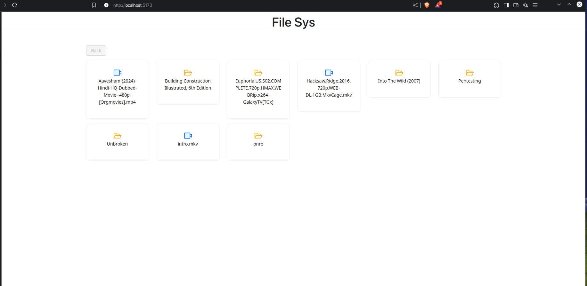
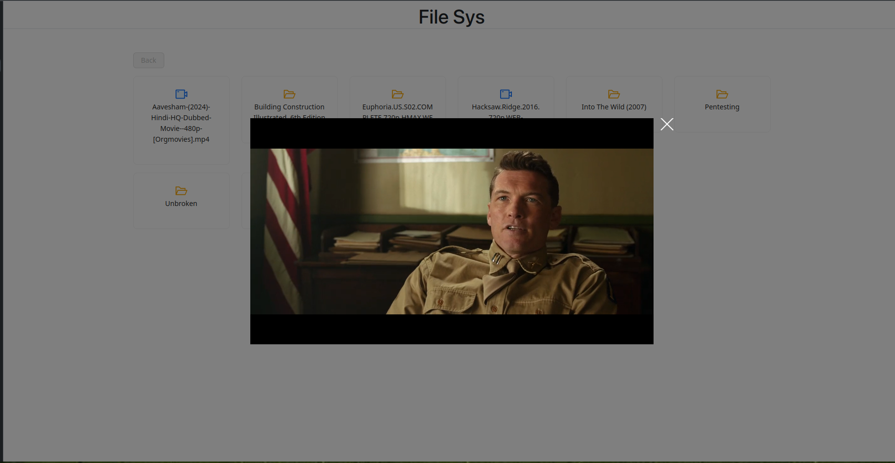

# FS-Viewer

> _ < cause the ones available on the internet suck

This is a basic file system viewer with authentication protection, folder traversal, and video streaming capabilities. It includes a single user login system, a simple interface for browsing files and folders, and the ability to stream videos directly from the server.

## Features

- [x] **Single User Login**  
  Basic authentication with a single user login for securing file access.
  
  - [x] **API**  
    Backend API for handling login authentication.
  
  - [ ] **Web Modal**  
    A login modal for the frontend that interacts with the API.

- [ ] **Stream Video**  
  Allows streaming video files directly from the file system.

  - [x] **API**  
    Backend API to support video streaming.
  
  - [ ] **Web Modal or Video Play**  
    Frontend UI to display and play videos, not yet decided.

- [ ] **Folder Traversal**  
  Browse through the folder structure and files.

  - [x] **API**  
    Backend API to support folder traversal.
  
  - [x] **Web (with Back Button)**  
    Web interface to traverse folders with a back button to navigate to the previous folder.
  
  - [ ] **Breadcrumbs to Show Current Location**  
    A UI feature to show the current folder path and allow users to jump between folder levels.

## Reference UI






This image represents the basic structure and layout of the application.

## Getting Started

### Prerequisites

- encore (encore.dev)
- simple prisma with sqlite
- Ant Design and Bootstrap for frontend

### Installation

1. Clone the repository:
   ```bash
   git clone https://github.com/your-repo/fs-viewer.git
   ```
2. Run the backend:
   ```bash
   > npm i
   > encore run
   ```
3. Run the web interface:
   ```bash
   npm i && npm run dev
   ```
